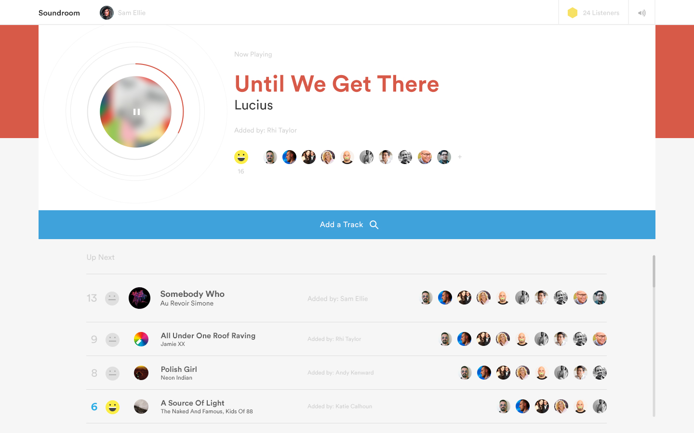

# Soundroom :sound::dancer:

Democratic playlist server and client for Spotify.

## Work In Progress

Soundroom is currently under development and will be freely usable by everyone shortly after Spotify release their [upcoming embedded libraries](https://developer.spotify.com/technologies/libspotify/).

## Server

Node.js express server exposing a REST and WebSocket API.

For documentation, see [server/README.md](server/README.md) 

## Client (React)

The new React + TypeScript client (very WIP, available on feature branch). 

For documentation, see [client-react/README.md](https://github.com/philipbulley/soundroom/blob/feature/client-react/client-react/README.md)

## Client (Angular 2)

The original Angular 2 client (currently has the most features). 

For documentation, see [client/README.md](client/README.md)

## Credits

* Front-end development by [Philip Bulley](https://github.com/philipbulley)
* Backend-end development by [Ian McGregor](https://github.com/ianmcgregor) and [Philip Bulley](https://github.com/philipbulley)
* UI design by [Kiko Seiz](https://twitter.com/kikoseiz)
